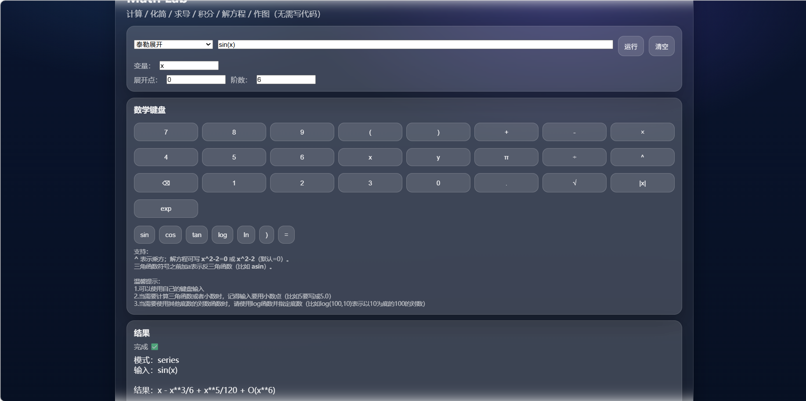
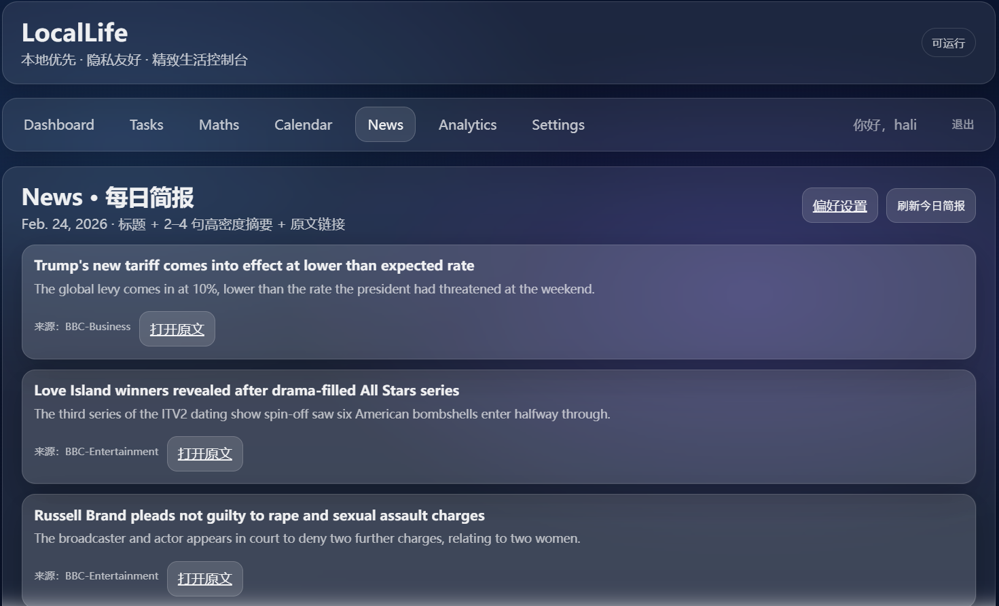
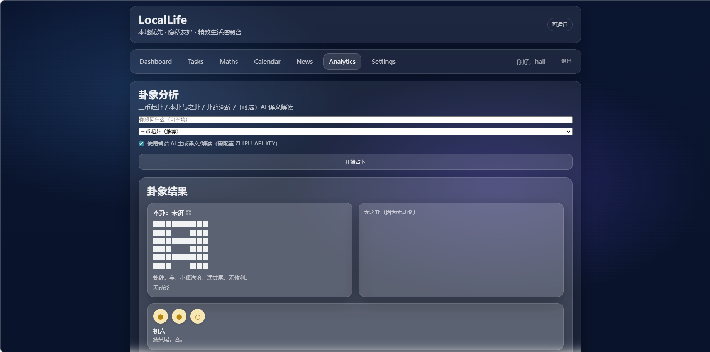
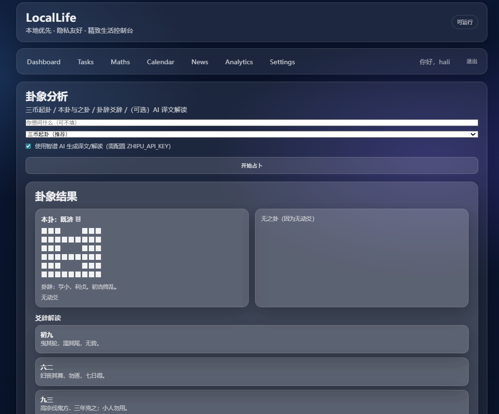

# LocalLife

LocalLife 是一个**本地优先、隐私友好**的个人生活控制台。它将任务管理、数学计算、新闻简报、日程规划、卦象分析和健康仪表盘整合在一个精致的毛玻璃界面中，帮助你在不依赖云端服务的情况下高效组织日常生活。

> ✨ **核心理念**：所有数据默认存储在本地 SQLite 数据库中，你的隐私不会被上传到任何第三方服务器（除你主动配置的 AI 接口外）。

---

## ✨ 功能亮点

### ✅ 任务管理 (Tasks)
- 支持三种计划方式：**不设置时间**、**绝对时刻**、**时间段**
- 到点提醒（浏览器通知 + 提示音），支持提前自定义分钟数
- 任务状态：待完成 / 已完成，一键切换
- 日历视图联动，直观查看每天的任务分布


### 🧮 数学实验室 (Maths)
- 基于 **SymPy** 的计算引擎，无需编写代码即可：
  - 表达式求值、化简
  - 求导（支持多阶）、积分（定/不定）
  - 解方程（符号解 / 数值解）
  - 2D / 3D 函数作图（matplotlib 实时渲染）
- 内置数学键盘，方便输入特殊符号和函数
- 


### 📰 新闻简报 (News)
- 每日自动聚合你感兴趣的新闻（支持 RSS / API）
- 个性化偏好设置：语言、地区、关键词、新闻主题
- 生成 2-4 句高密度摘要 + 原文链接，快速掌握要点
- 可手动刷新今日简报
- 


### 📅 日历计划 (Planner)
- 月视图 / 日视图展示任务，支持显示/隐藏已完成任务
- 每个日期格内可直接点击「+」快速创建当天的任务
- 未设置时间的任务单独列在下方，不丢失



### 🔮 卦象分析 (Analytics - I Ching)
- 传统三币起卦（支持纯随机/时间起卦）
- 自动匹配本卦、之卦，展示卦辞、爻辞
- 可选集成智谱 AI，生成白话译文、行动建议及历史典故
- 纯文化体验与自我反思，不替代专业建议



### ❤️ 健康仪表盘 (Dashboard)
- 填写身高、体重、年龄、性别后，自动调用 AI 生成个性化健康分析报告
- 包括 BMI 计算、风险提示、生活习惯建议
- 结果缓存，避免重复调用 API


### ⚙️ 其他特性
- 完整的用户认证（注册 / 登录 / 退出）
- 响应式设计，适配桌面和移动端
- 毛玻璃美学 UI，所有卡片均可交互
- 所有数据归你所有，无强制云端同步

---

## 🛠️ 技术栈

- **后端**：Django 4.x + SQLite（默认，可切换其他数据库）
- **前端**：原生 HTML/CSS/JavaScript，毛玻璃效果（CSS backdrop-filter）
- **数学引擎**：SymPy, matplotlib, numpy
- **AI 集成**：智谱 API（可选，用于健康分析、卦象解读）
- **新闻抓取**：feedparser（RSS），requests（API）

---

## 📦 安装与运行

### 1. 克隆仓库
```bash
git clone https://github.com/yourusername/LocalLife.git
cd LocalLife
```

### 2. 创建并激活虚拟环境
```bash
python -m venv venv
source venv/bin/activate   # Linux/macOS
venv\Scripts\activate      # Windows
```

### 3. 安装依赖
```
pip install -r requirements.txt
```
> 若没有 `requirements.txt`，可手动安装核心依赖：
> ```
> pip install django sympy matplotlib numpy openai feedparser requests
> ```

### 4. 数据库迁移
```bash
python manage.py migrate
```

### 5. 配置环境变量（可选）
在项目根目录创建 `.env` 文件，或直接在系统中设置以下变量：
```
# Django 密钥（生产环境必须修改）
SECRET_KEY=your-secret-key

# 智谱 AI API（用于健康分析和卦象解读，若不使用可留空）
OPENAI_API_KEY=your-zhipu-api-key
ZAI_BASE_URL=https://open.bigmodel.cn/api/paas/v4
ZAI_MODEL=glm-4
```

> 注意：代码中智谱客户端使用 `OPENAI_API_KEY` 作为变量名，但实际应填入智谱的 API Key。

### 6. 运行开发服务器
```bash
python manage.py runserver
```

访问 http://127.0.0.1:8000 即可开始使用。

---

## 📖 使用指南

- **首次使用**：注册一个账号，登录后即可访问所有模块。
- **任务管理**：在「Tasks」中新建任务，设置时间与提醒，完成后点击「完成」。
- **数学计算**：在「Maths」中选择模式，输入表达式（如 `sin(x)^2+cos(x)^2`），点击运行，结果会以文本或图片形式展示。
- **新闻简报**：在「News」中先进入「偏好设置」配置你的兴趣，然后点击「刷新今日简报」获取最新摘要。
- **日历计划**：在「Calendar」中查看月视图，点击日期数字进入日视图，可以查看/编辑当天任务。
- **卦象分析**：在「Analytics」中填写问题（可选），选择起卦方法，勾选「使用 AI」可获得额外解读。
- **健康仪表盘**：先去「Settings」填写身高、体重、年龄、性别，返回 Dashboard 即可看到 AI 生成的分析。

---

## 🤝 贡献指南

欢迎任何形式的贡献！无论是新功能、Bug 修复、文档改进还是翻译。

1. Fork 本仓库
2. 创建你的特性分支 (`git checkout -b feature/AmazingFeature`)
3. 提交你的改动 (`git commit -m 'Add some AmazingFeature'`)
4. 推送到分支 (`git push origin feature/AmazingFeature`)
5. 打开一个 Pull Request

请确保代码风格遵循 PEP8，并在必要时添加测试。

---

## 📄 许可证

本项目采用 MIT 许可证。详见 [LICENSE](LICENSE) 文件。

---

## 📬 联系

如有任何问题或建议，请通过 GitHub Issues 与我们联系。

---

**LocalLife** — 你的本地生活，由你掌控。